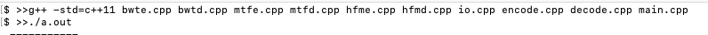

# ⭐ Title : Apply burrow wheeler transform algorithm in data compression ⭐

## How to clone this project

1. Install git(Not installed)

- [Install](https://git-scm.com/book/en/v2/Getting-Started-Installing-Git)

2. Open terminal or command prompt and using command to navigate to your desktop(optional):

```
cd Desktop
```

3. Using "git clone" command  in terminal(mac) or Command Prompt(window):

```
git clone + https://github.com/nguyendinhlam88/Project1.git
``` 

## Language : C++11 
1. C++11 is easy to work with unicode file
2. Now i used g++ on terminal(Mac os) to compile this project.
- 
3. You can also use IDE as codeblock ...
- [CodeBlock](http://www.codeblocks.org/downloads/26)
- [Dowload](https://www.fosshub.com/Code-Blocks.html?dwl=codeblocks-17.12mingw-setup.exe)

## Program Logic : 
1. Using text file to compress(C++ not supported for pdf/docx. For further, you can dowload more library to read file pdf/docx).
2. I use pipeline for build this project : 
> BWT \> Move To Front \> Huffman ***
3. unicode : Unicode 13.0(Only use public unicode character for build unicode in MTF).
## References
- [1] Burrows, Michael; Wheeler, David J. (1994), [A block sorting lossless data compression algorithm](https://www.hpl.hp.com/techreports/Compaq-DEC/SRC-RR-124.html), Technical Report 124, Digital Equipment Corporation
- [2] Ryabko, B. Ya Data compression by means of a "book stack”, Problems of Information Transmission, 1980
- [3] Huffman's original article: D.A. Huffman, ["A Method for the Construction of Minimum-Redundancy Codes"](http://compression.ru/download/articles/huff/huffman_1952_minimum-redundancy-codes.pdf), Proceedings of the I.R.E., sept 1952, pp 1098–1102

## Contact: 
- bachkhoahn2k@gmail.com


